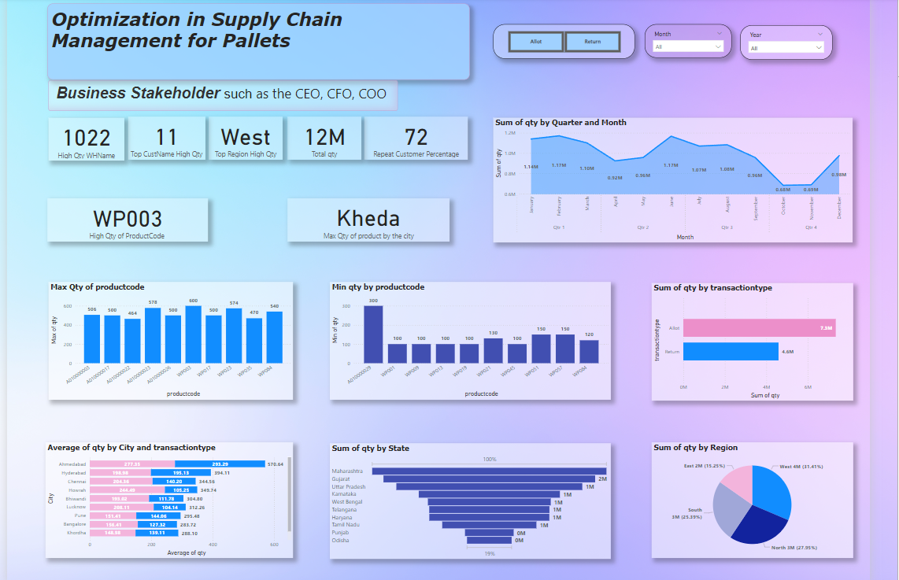
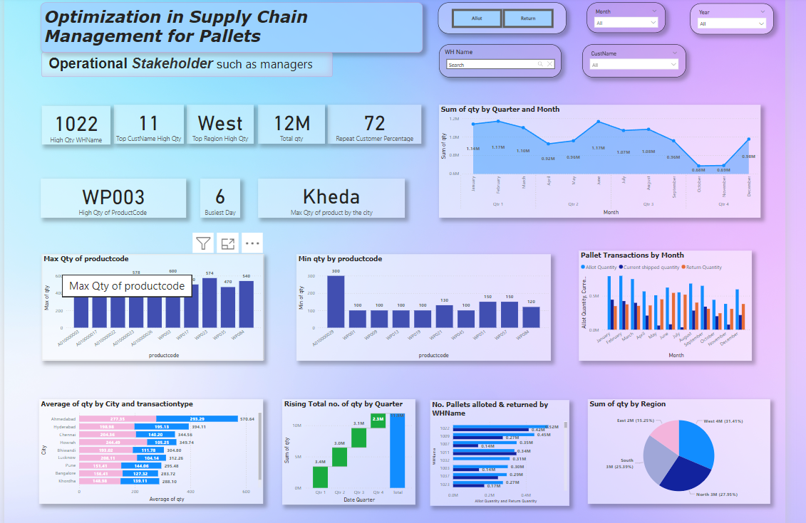

# Optimization in Supply Chain Management for a Leading Pallet Manufacturer

This repository contains the data analysis project aimed at optimizing pallet inventory management for a leading pallet manufacturer. By leveraging data-driven insights, the project reduced stock volatility and minimized human intervention, significantly improving the company's operational efficiency.

## 📝 Project Overview

**Project Duration**: September 2023 - October 2023  
**Associated with**: INNODATATICS | Innovation | Data | Analytics

### Business Problem

The company faced challenges in determining the optimal number of pallets to store for shipping to various customers. The project’s goal was to analyze pallet transaction data to minimize inventory volatility and improve resource allocation across warehouses.

### Business Insights

- **Pallet Transactions**: A total of 64,024 transactions from January 1, 2019, to August 23, 2023, with an average of 232 transactions per day.
- **Allotments vs. Returns**: More allotment transactions (35,848) than returns (28,176), indicating a net increase in pallets in circulation.
- **Statistical Observations**:
  - **Allotments** generally larger and more variable than returns, with positive skewness and kurtosis.
  - **Returns** showed negative skewness and lighter tails.
- **Customer Insights**: Customer 12 had the highest allotments, while Customer 11 had the most returns, helping target customer-specific strategies.
- **Warehouse Performance**: WHName 1009 was the busiest for allotments and returns, while WHName 1017 and 1057 were least busy for allotments and returns, respectively.
  
These insights inform business strategies, resource allocation, and customer prioritization.

## 📊 Key Responsibilities

1. **Data Collection & Cleaning**: Collected and prepared data for analysis, ensuring accuracy and completeness.
2. **Exploratory Data Analysis (EDA)**: Conducted EDA using Python and SQL to identify trends, patterns, and anomalies.
3. **Operational Efficiency Enhancement**: Improved efficiency by 90% through data analysis, reducing the need for manual intervention.
4. **Dashboard & Reporting**: Generated insightful dashboards and reports using Power BI, Google Looker Studio, and Excel.

## 🛠️ Tools & Technologies

- **Languages**: Python, SQL
- **Libraries**: Pandas, NumPy, Matplotlib
- **Visualization & Reporting**: Power BI, Google Looker Studio, Microsoft Excel

## 📈 Results & Insights

- **Data Summary**: Identified transaction frequency, customer demand patterns, and distribution trends.
- **Statistical Analysis**: Provided insights into transaction skewness, variance, and central tendencies to improve inventory planning.
- **Warehouse Optimization**: Optimized warehouse allocation by assessing transaction loads across different warehouses.
## 📊 Dashboards

Here are two sample dashboards generated during the project, showcasing key insights for stakeholders and operational managers.

### Stakeholder Dashboard
This dashboard provides high-level insights for stakeholders, highlighting key metrics and trends in pallet transactions.



### Operational Manager Dashboard
The operational manager dashboard focuses on day-to-day metrics, assisting in inventory management and resource allocation.



## 📂 Repository Structure

```plaintext
optimization-supply-chain-management-pallets/
├── data/                     # Contains raw and cleaned datasets
├── EDA/                      # Exploratory Data Analysis scripts for data understanding
├── notebooks/                # Jupyter notebooks with EDA and analysis
├── Dashboards/                  # Power BI and Looker Studio reports
├── Scripts/                      # Python scripts for data processing
└── README.md                 # Project README file
```

